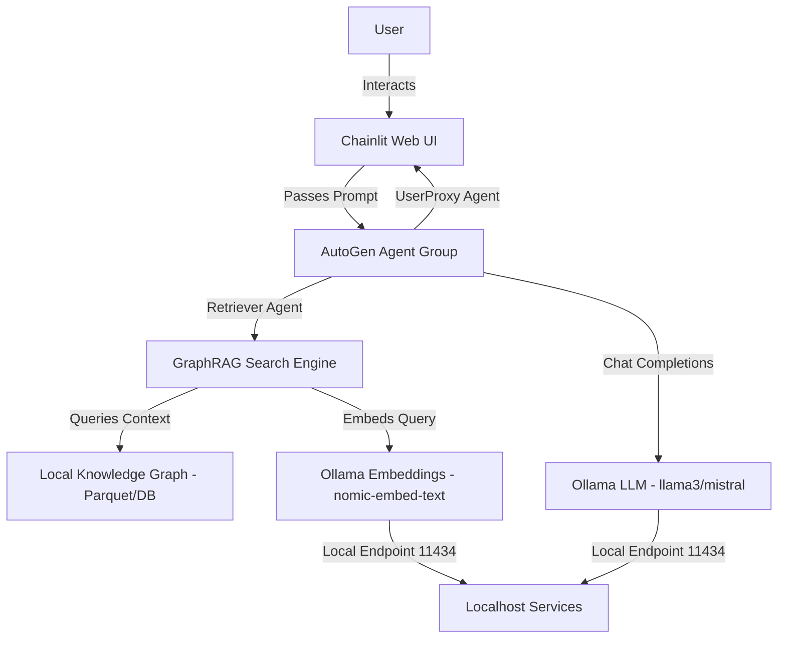

# OllaGraph-Agents

[](https://opensource.org/licenses/MIT)
[](https://www.python.org/)
[](https://github.com/microsoft/autogen)
[](https://github.com/microsoft/graphrag)
[](https://ollama.com/)

A private, secure, and fully offline Retrieval-Augmented Generation (RAG) assistant. This application builds a structured knowledge graph from your local text documents using **Microsoft GraphRAG**, orchestrates cooperative multi-agent discussions using **AG2 (AutoGen)**, runs all inference locally via **Ollama**, and exposes a web chat client built on **Chainlit**.

---

## 📖 Table of Contents
* [System Architecture](#-system-architecture)
* [Application Flow](#-application-flow)
* [Features](#-features)
* [Quick Start (Local Setup)](#-quick-start-local-setup)
* [Configuration Guide](#-configuration-guide)
* [Developer Experience](#-developer-experience)
* [Security & Privacy](#-security--privacy)
* [Performance & Optimization](#-performance--optimization)
* [License](#-license)

---

## 🏗️ System Architecture

The following diagram illustrates the components of the local RAG stack and the data flow between them:



---

## 🔄 Application Flow

The sequence of operations when answering a user question is detailed below:

```mermaid
sequenceDiagram
    autonumber
    actor User
    participant UI as "Chainlit UI"
    participant Agent as "AutoGen Agent Group"
    participant RAG as "GraphRAG"
    participant Ollama as "Ollama API (Local)"

    User->>UI: Submit Question/Query
    UI->>Agent: Trigger Conversation Loop
    Agent->>RAG: Invoke query_graphRAG Tool
    alt Local Search Mode
        RAG->>Ollama: Generate query embeddings
        Ollama-->>RAG: Return float list
        RAG->>RAG: Retrieve neighboring entity nodes & summaries
    else Global Search Mode
        RAG->>RAG: Retrieve community reports & summaries
    fi
    RAG->>Ollama: Synthesize retrieved context into answer
    Ollama-->>RAG: Return summarized context
    RAG-->>Agent: Return retrieved search text
    Agent->>Ollama: Generate agent response conversation
    Ollama-->>Agent: Return response text
    Agent-->>UI: Stream agent conversation messages
    UI-->>User: Display final response & chat history
```

---

## 🌟 Features

* **Complete Data Privacy:** Runs entirely offline on your local CPU/GPU hardware. No prompts, queries, or documents are transmitted to external services.
* **Knowledge Graph Construction:** Moves beyond basic chunk-similarity search by building semantic knowledge graphs representing entity connections, relationships, and hierarchical communities.
* **Hybrid Search Options:** Supports targeted local queries (focusing on specific entities) and global synthesis (summarizing themes across the entire document corpus).
* **Multi-Agent Orchestration:** Uses AutoGen agents to collaborate, review, and refine research findings before presenting them to the user.
* **Highly Optimized Embeddings:** Uses a custom non-blocking AsyncClient batch embedding adapter to feed data efficiently to local embedding services.

---

## 🚀 Quick Start (Local Setup)

### Prerequisites
* **Python:** 3.10 or higher.
* **Ollama:** Installed and running on `localhost:11434`.

### 1. Model Pulling
Ensure you have pulled the required LLM and embedding models in Ollama:
```bash
# Pull the default LLM
ollama pull llama3

# Pull the default embedding model
ollama pull nomic-embed-text
```

### 2. Dependency Installation
We recommend using **`uv`** for fast and secure virtual environment and package installation:
```bash
# Create virtual environment
uv venv

# Activate venv
source .venv/bin/activate

# Install requirements
uv pip install -r requirements.txt
```

### 3. Initialize & Launch
Run the automated script `run_project.sh` to initialize settings, patch the local GraphRAG library with Ollama compatibility wrappers, and launch the Chainlit interface:
```bash
chmod +x run_project.sh
./run_project.sh
```

---

## ⚙️ Configuration Guide

### GraphRAG Settings (`settings.yaml`)
You can adjust search, chunking, and modeling behavior inside your root `settings.yaml` file:

```yaml
llm:
  model: mistral                  # Local LLM chat model
  api_base: http://localhost:11434/v1

embeddings:
  llm:
    model: nomic_embed_text       # Local embedding model
    api_base: http://localhost:11434/api

chunks:
  size: 300                       # Input chunk size in tokens
  overlap: 100                    # Overlap between consecutive chunks
```

### Agent Configuration (`app.py`)
To change model parameters, timeouts, or system personas for the AutoGen agents, modify the initialization configurations inside `app.py`:
- Modify the `system_message` on the `Retriever` or `User_Proxy` agents.
- Customize the chat manager's `MAX_ITER` loop bounds.

---

## 🛠️ Developer Experience

### Local Development Setup
If you want to contribute or modify the codebase, initialize the development mode:

1. **Install Dev Dependencies:**
   ```bash
   uv pip install flake8 black mypy
   ```

2. **Run Linting & Code Verification:**
   Ensure files are linted and formatted:
   ```bash
   black --check src/ app.py
   flake8 src/ app.py
   mypy src/ app.py
   ```

### Contribution Guidelines
We welcome open-source contributions!
1. Fork this repository.
2. Create a feature branch: `git checkout -b feature/my-feature`.
3. Verify changes with unit tests and code checks.
4. Open a Pull Request with a clear description of the modifications.

---

## 🛡️ Security & Privacy

This project follows secure-by-default standards:
* **Zero Cloud Exposure:** Built specifically for secure air-gapped environments.
* **Protected Port Binding:** Bound exclusively to `127.0.0.1` (localhost) to prevent external sniffing and unauthorized network requests.
* **Git Safe Guarding:** Comes with a `.gitignore` configured to block indexing outputs (`output/`), document sources (`input/`), local cache directories (`cache/`), and environment files (`.env`) from leaking into public Git repositories.
* **No Hardcoded Secrets:** Uses environment variable parsing (`${GRAPHRAG_API_KEY}`) to load API tokens dynamically when cloud configurations are enabled.

---

## ⚡ Performance & Optimization

* **Batch Embedding API:** The custom Ollama adapter handles batch queries dynamically, feeding lists of strings directly to Ollama in one HTTP request instead of invoking it in sequential blocks.
* **Asynchronous Execution:** Async implementations of embedding generations are used (`AsyncClient.embed`) to prevent event loop blockages during search queries.

---

## 📄 License
This project is licensed under the MIT License - see the [LICENSE](LICENSE) file for details.
