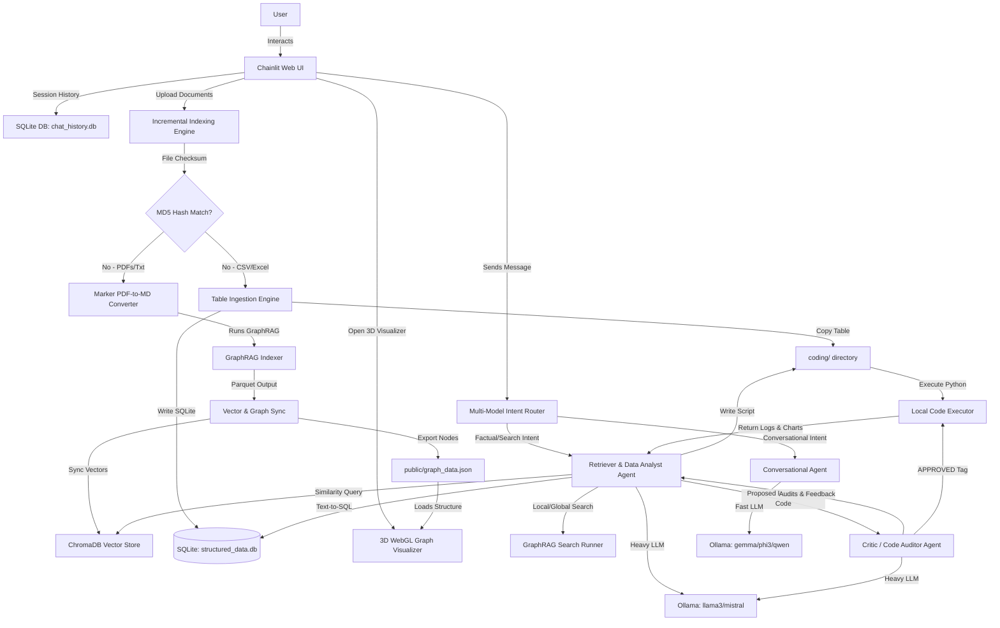
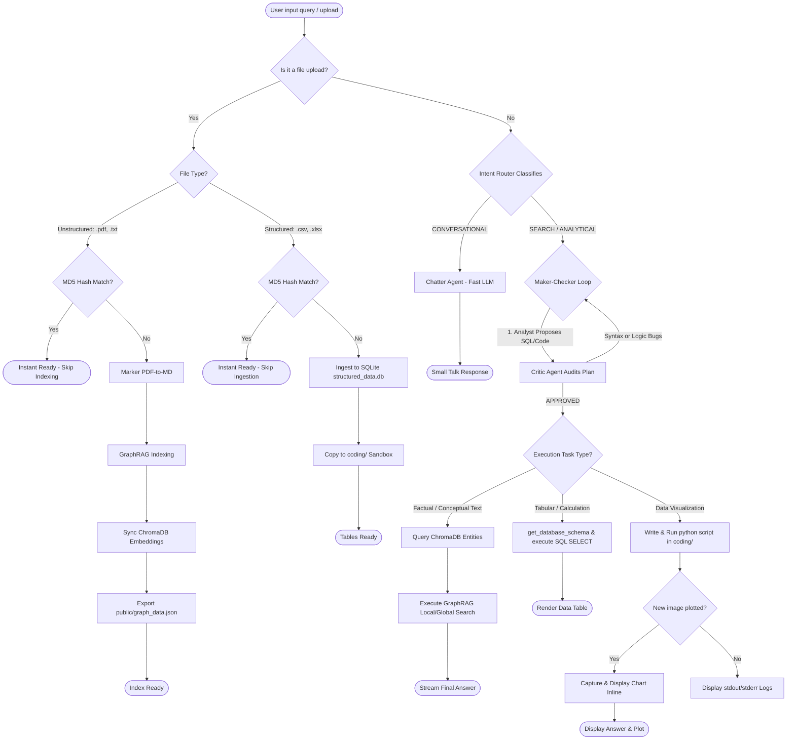
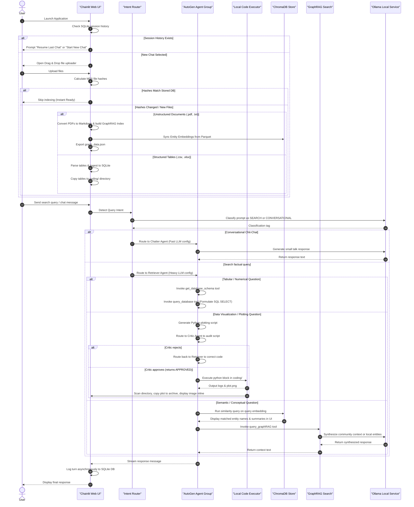

# OllaGraph-Agents

[](https://opensource.org/licenses/MIT)
[](https://www.python.org/)
[](https://github.com/microsoft/autogen)
[](https://github.com/microsoft/graphrag)
[](https://ollama.com/)

OllaGraph-Agents is a private, secure, and fully offline hybrid RAG and Data Analysis system. It builds a semantic knowledge graph from local documents using **Microsoft GraphRAG**, orchestrates multi-agent group discussions using **AG2 (AutoGen)**, manages persistent session state and hashes using **SQLite**, indexes entity descriptions locally in **ChromaDB**, runs all LLM inference via **Ollama**, and serves a gorgeous macOS Glassmorphism web client built on **Chainlit** including a **3D WebGL Force-Directed Graph Visualizer**, a **Sandboxed Python Code Execution environment**, and a **Maker-Checker Loop** featuring an Analyst and a Code Critic.

---

## 📖 Table of Contents
* [System Architecture](#-system-architecture)
* [Query Routing Decision Flow](#-query-routing-decision-flow)
* [Application Flow](#-application-flow)
* [Key Features](#-key-features)
* [Quick Start (Local Setup)](#-quick-start-local-setup)
* [Configuration Guide](#-configuration-guide)
* [Developer Experience](#-developer-experience)
* [Security & Privacy Audit](#-security--privacy-audit)
* [Performance & Optimization](#-performance--optimization)
* [License](#-license)

---

## 🏗️ System Architecture

The following diagram illustrates the relationship between the front-end interface, local database modules, agent executors, and the Ollama service:



---

## 🧠 Query Routing Decision Flow

The following decision tree details how user requests are routed, analyzed, audited, and processed through different execution paths:



---

## 🔄 Application Flow

The sequence of operations when initiating a user session and routing queries is described below:



---

## 🌟 Key Features

1. **Persistent SQLite Memory (WAL Mode):**
   * Persists message logs and session tables using asynchronous SQLite (`aiosqlite`).
   * Configures Write-Ahead Logging (WAL) and 5000ms busy timeout properties, preventing write contentions and locking conditions.
   * Action buttons allow users to seamlessly **Resume Last Chat** or **Start New Workspace Sessions** on startup.
2. **Multi-Model Orchestration & Dynamic Routing:**
   * Discovers local Ollama models dynamically on launch, assigning fast models (`gemma/phi3/qwen`) to conversational queries and heavy models (`llama3/mistral`) to deep context searches.
   * Employs intent-based routing to bypass costly GraphRAG search routines when user inputs are simple greetings.
3. **Maker-Checker Agentic Loop (Self-Correction):**
   * Implements a secure **Analyst-Critic** loop inside the search agent group chat.
   * The `Retriever` (Analyst) proposes SQL/Python code or analytical answers.
   * The `Critic` (Auditor) intercepts the draft, validates schema syntax, ensures no write-operations are present, and checks python import packages.
   * Only once the Critic outputs the `"APPROVED"` tag does AutoGen execute the script or return the answer to the user.
4. **Generalized Structured Table Querying (Text-to-SQL):**
   * Dynamically ingests `.csv`, `.xlsx`, and `.xls` files into a persistent SQLite database (`db/structured_data.db`).
   * Equips agents with schema discovery tools to inspect columns and write mathematically precise SQLite SELECT queries, eliminating LLM math errors.
   * Bypasses heavy document parsing and GraphRAG indexing when only spreadsheet files are uploaded.
5. **Sandboxed Python Code Execution (Data Analyst):**
   * Configures a local working directory (`coding/`) where the agents can read and write python scripts.
   * The custom `ChainlitUserProxyAgent` intercepts local executions and checks for newly created plots and charts.
   * Automatically copies generated image charts (`.png`, `.jpg`, `.jpeg`) to `coding/archive/` and renders them inline inside the Chainlit chat UI.
6. **Local Persistent Vector Store (ChromaDB):**
   * Embeds entity metadata and names into a persistent local collection (`db/chroma`).
   * Renders the top matched nodes inside the chat window before invoking GraphRAG search queries, showing users what references were found in the vector index.
7. **Smart Incremental Indexing Engine:**
   * Calculates MD5 hashes of uploaded documents and stores them in SQLite (`indexed_files`).
   * Bypasses the heavy PDF-to-Markdown parser (Marker) and GraphRAG index creation if file hashes are unchanged, keeping setup instant.
8. **Interactive 3D WebGL Graph Visualizer:**
   * Reads node and relationship parquets and exports coordinates, type tags, and link connections to `public/graph_data.json`.
   * Serves an interactive 3D WebGL page from `/public/graph_visualizer.html` featuring:
     - **Legend Groups:** Filter and highlight nodes by entity type.
     - **Spotlight Search:** Instantly filters matching entities and dims unrelated nodes.
     - **Camera Navigation:** Click nodes to center the WebGL camera smoothly.
     - **Detail Cards:** Displays complete entity details and connection weights on hover.

9. **Asynchronous LLM Observability (Langfuse):**
   * Automatically traces all Ollama completions, agent prompts, model tokens, and response latencies.
   * Leverages global module monkeypatching at application startup to capture traces non-invasively.
   * Gracefully falls back to normal execution if Langfuse keys are absent, keeping the offline setup fully functional.

---

## 🚀 Quick Start (Local Setup)

### Prerequisites
* **Python:** Version 3.10 or higher.
* **Ollama:** Installed and running locally on port `11434`.

### 1. Pull Local Models
Verify you have pulled the required LLM and embedding models in Ollama:
```bash
# Pull the default Reasoning LLM
ollama pull llama3

# Pull the default Embedding Model
ollama pull nomic-embed-text
```

### 2. Install Dependencies
We recommend utilizing `uv` for fast package downloads:
```bash
# Create virtual environment
uv venv

# Activate virtual environment
source .venv/bin/activate

# Install requirements
uv pip install -r requirements.txt
```

### 3. Launch the Project
Run the startup script. It automatically verifies model presence, patches the GraphRAG package with Ollama-compatible adapters, and starts the UI:
```bash
chmod +x run_project.sh
./run_project.sh
```

---

## ⚙️ Configuration Guide

### Custom GraphRAG settings (`settings.yaml`)
Configurations are defined inside your root `settings.yaml`. A default template is saved inside `templates/settings.yaml`.
* **llm.type / embeddings.llm.type:** Configured as `openai_chat` and `openai_embedding` respectively.
* **api_base:** Configured to point to Ollama's local endpoints (`http://localhost:11434/v1` and `http://localhost:11434/api`).

### Observability Configuration (`.env`)
To enable Langfuse tracing:
1. Create a `.env` file in the root workspace directory.
2. Add your Langfuse keys (sign up at [langfuse.com](https://langfuse.com) or self-host a local instance):
```bash
LANGFUSE_PUBLIC_KEY=pk-lf-your-public-key
LANGFUSE_SECRET_KEY=sk-lf-your-secret-key
LANGFUSE_BASE_URL=https://cloud.langfuse.com
```

### Offline Mock Interfaces
If you wish to test or preview the user interface styling locally without launching the Python server or downloading models, open these files directly in your browser:
* **Mock Chat UI:** [public/mock_chat_ui.html](file:///home/alpha-square/Videos/Autogen_GraphRAG_Ollama-main/public/mock_chat_ui.html)
* **Mock 3D Graph Visualizer:** [public/mock_graph_visualizer.html](file:///home/alpha-square/Videos/Autogen_GraphRAG_Ollama-main/public/mock_graph_visualizer.html)

---

## 🛠️ Developer Experience

### Local Linting & Formatting
To keep code clean and maintain separation of concerns:
```bash
# Install toolchains
pip install black flake8 mypy

# Check formatting
black --check src/ app.py

# Lint checks
flake8 src/ app.py
```

### Contribution Workflow
1. Fork the project repository.
2. Create a development feature branch: `git checkout -b feature/my-cool-feature`.
3. Test changes locally using `run_project.sh` and offline mockup files.
4. Ensure files are linted, then open a Pull Request.

---

## 🛡️ Security & Privacy Audit

* **100% Data Privacy:** Zero cloud connections. All prompts, indexing steps, and vector search operations are executed on your local device.
* **Port Bindings:** The Chainlit development web server binds explicitly to localhost `127.0.0.1`, shielding active processes from network sniffers.
* **Sensitive Exclusions:** `.gitignore` blocks source materials (`input/`), parquet outputs (`output/`), vector directories (`db/`), execution directories (`coding/`), and configuration files (`settings.yaml`) from being pushed to public remotes.
* **Credentials Management:** Relies on env string interpolation (`${GRAPHRAG_API_KEY}`) to load keys dynamically when cloud options are chosen.
* **Sandboxed Code Execution Guard:** While the agent executes Python code directly on the host machine, security is maintained via `human_input_mode="ALWAYS"` on the `User_Proxy` agent. This guarantees that **no code will be executed without the user's manual review and approval**.

---

## ⚡ Performance & Optimization

* **Write-Ahead Logging (WAL):** Prevents database write blockages by writing message histories in parallel logs.
* **Parallel Processing:** Uses PyTorch multi-process spawning for Marker layout conversions, matching VRAM constraints automatically.
* **Non-Blocking Network Calls:** Interrogates Ollama using asynchronous client requests (`AsyncClient`), avoiding event loop starvation.

---

## 📄 License
This project is licensed under the MIT License - see the [LICENSE](LICENSE) file for details.
